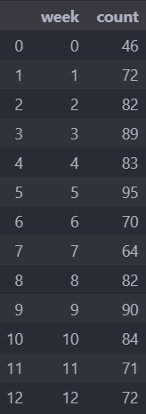
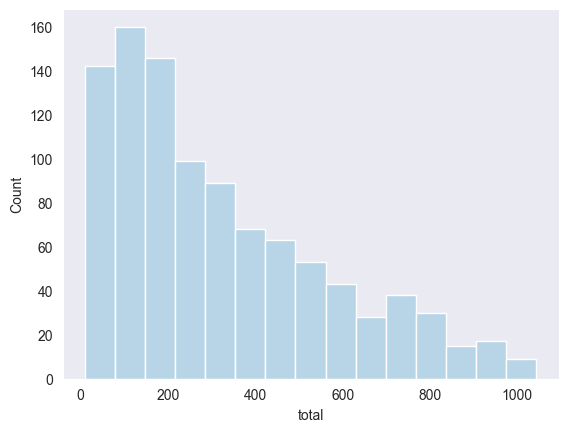

<h1 align="center" style="color:White">SUPERMARKET SALES</h1>

------
<h3 align="center" style="color:White">INTRODUCTION </h3>

------
 
<h4 align="center" style="color:White">About Dataset </h4

The dataset Students Performance in Exams is taken from the platform [Kaggle](https://www.kaggle.com/datasets/aungpyaeap/supermarket-sales). The growth of supermarkets in most populated cities are increasing and market competitions are also high. The dataset is one of the historical sales of supermarket company which has recorded in 3 different branches for 3 months data. Predictive data analytics methods are easy to apply with this dataset.


##### Attribute information

- **Invoice id:** Computer generated sales slip invoice identification number
- **Branch**: Branch of supercenter (3 branches are available identified by A, B and C).
- **City:** Location of supercenters
- **Customer type:** Type of customers, recorded by Members for customers using member card and Normal for without member card.
- **Gender:** Gender type of customer
- **Product line:** General item categorization groups Electronic accessories, Fashion accessories, Food and beverages, Health and beauty, Home and lifestyle, Sports and travel
- **Unit price:** Price of each product in $
- **Quantity:** Number of products purchased by customer
- **Tax:** 5% tax fee for customer buying
- **Total:** Total price including tax
- **Date:** Date of purchase (Record available from January 2019 to March 2019)
- **Time:** Purchase time (10am to 9pm)
- **Payment:** Payment used by customer for purchase (3 methods are available – Cash, Credit card and Ewallet)
- **COGS:** Cost of goods sold
- **Gross margin percentage:** Gross margin percentage
- **Gross income:** Gross income
- **Rating:** Customer stratification rating on their overall shopping experience (On a scale of 1 to 10)

<h4 align="center" style="color:White">About Research </h4>

In this study I have analyzed the sales of three supermarkets. I analyzed each product line individually. I also analyzed sales by month, by day of the week and by week. In this study I did a lot of work with time. I converted date as in weeks, months, days, days of the week and time as in hours. Also built a lot of graphs: pie, barplot, lineplot, histplot, relplot. Figured out the percentages of different payment methods. **The jupyter notebook describes everything, what which part of the code does what.**  

In this study you will see all the **steps**:

 1. *Data cleaning*

 2. *Data analysis*

 3. *Conclusions*

------

<h3 align="center" style="color:White">Data Cleaning </h3>

------

Import pandas, seaborn, matplotlib libraries. Also choose the style of graphs we are going to build 

```py
import pandas as pd 
import seaborn as sns
import matplotlib.pyplot as plt


sns.set_style("dark")
sns.set_palette("Paired")
```
Read data

```py
path_to_file = r'D:\university\VSCODE\project\Supermarket_sales\supermarket_sales.csv'
df = pd.read_csv(path_to_file)
df
```
 
Be sure to check for duplicates. 

```py
df.duplicated().any()
#False
```
The result is False. This means that no duplicates were found in our data.

Next, let's create a dataframe that contains data about the number of null values, the percentage of null values and the number of unique values.

```py
pd.DataFrame({'count': df.shape[0], 
              'nulls': df.isnull().sum(), 
              'nulls%': df.isnull().mean() * 100, 
              'cardinality': df.nunique(),
             })
```

<p align="center">

</<p align="center">

No null values were seen - so our dataset is completely clean.  

```py
df.dtypes
```

<p align="center">

</<p align="center">

We need to change the type of date and time columns to datetime64[ns] for convenient work with these columns. 

```py
df['Date'] = pd.to_datetime(df['Date'])
df['Time'] = pd.to_datetime(df['Time'])
```

Also need to change the name of the columns to make it easier to refer to them (with a dot).  

```py
def rename_columns(name):
    new_name = name.lower().replace(' ','_')
    return new_name
```

```py
df.rename(columns= rename_columns,inplace=True)
```

Now create a new dataset that will consist of columns that we will use in further calculations.

```py
df1 = df[['city','gender','total','date','payment','time','product_line']]
```

Add new columns: month name, day name, day number of the week, hour and what week it is. 

```py
df1['month'] = pd.DatetimeIndex(df1['date']).month_name()
df1['weekday'] = pd.DatetimeIndex(df1['date']).day_name()
df1['weekday_number'] = pd.DatetimeIndex(df1['date']).weekday
df1['hour'] = pd.DatetimeIndex(df1['time']).hour
# df1["Hours"] = df1["time"].apply(lambda x: x.hour)
df1['week'] = df1['date'].dt.strftime('%U').astype(int)
```

---

<h3 align="center" style="color:White">Data Analysis</h3

---
---

Let's count the number of purchases by week.

```py
count_week = df1.week\
        .value_counts()\
        .reset_index()\
        .sort_values('week')\
        .reset_index()\
        .drop('index',axis=1)
count_week
```

<p align="center">

</<p align="center">

In this view, the dynamics of the change in the number of purchases is not quite clear, so let's make a graph!

```py
sns.lineplot(count_week,x='week',y='count', marker='o')
```

<p align="center">

</<p align="center">

We see a gradual increase and then a drop in week 6 and 7 and then an increase after that.

Let's estimate the revenue by week.

```py
revenue_week = df1.groupby('week')\
                .agg({'total':'sum'})\
                .reset_index()\
                .rename(columns={'total':'revenue'})
revenue_week
```

<p align="center">

</<p align="center">

Let's also plot the graph for this table.

```py
sns.lineplot(revenue_week,x='week',y='revenue',marker='o')
```

<p align="center">

</<p align="center">

We see almost the same graph, because the number of purchases is highly correlated with revenue.

Let's see who brought in the most revenue women or men.

```py
gender_sum = df1.groupby(['gender'],as_index=False)\
                .agg({'total':'sum'})\
                .rename(columns={'total':'revenue'})
```

|gender|revenue|
|-------|-------|
|     Female   | 167882.925 
| Male | 155083.824

The women made the most profit.

Let's also see which city made the most profit.

```py
city_sum = df1.groupby(['city'],as_index=False)\
            .agg({'total':'sum'})\
            .rename(columns={'total':'revenue'})\
            .sort_values('revenue',ascending=False)
city_sum
```
|city|revenue
|-|-|
Naypyitaw|	110568.7065
Yangon|	106200.3705
Mandalay|	106197.6720

The city of Naypyitaw made the most profit.

Let's make a histogram that shows the number of purchases with a certain price.

```py
sns.histplot(data= df1, x= 'total')
```

<p align="center">

</<p align="center">

We see that most purchases are in the 0-200 range.

Let's break them down by gender.

```py
sns.histplot(df1, x= 'total',  hue="gender",multiple='stack')
```

<p align="center">

</<p align="center">

Let's read the number of purchases and profits by different payment types.

```py
payment = df1.groupby('payment',as_index=False)\
            .agg({'gender':'count', 'total' : 'sum'})\
            .rename(columns = {'gender' : 'count', 'total' : 'sum'})\
            .sort_values('sum',ascending = False)\
            .rename(columns = {'sum' : 'revenue'})
payment
```

|payment	|count	|revenue
|--|--|--|
|	Cash	|344	|112206.570
|Ewallet	|345	|109993.107
|Credit card	|311	|100767.072

Let's make a graph that shows the percentages.

```py
fig, ax = plt.subplots()
expold = (0.07, 0.01, 0.01)
ax.pie(payment.revenue, labels=payment.payment, autopct='%1.1f%%', explode=expold ,startangle=90)
```

<p align="center">

</<p align="center">


Let's calculate the profit by month and day of the week.

```py
rating_weekday = df1.groupby(['month','weekday','weekday_number'], as_index= False)\
                    .agg({'total' : 'sum'})\
                    .rename(columns = {'total' : 'revenue'})\
                    .sort_values(['month', 'weekday_number'])
```

weekday_number we used to sort the day of the week correctly.
Let's visualize it immediately on the chart!

<p align="center">

</<p align="center">

Next, let's look at the dynamics of profit by hour in different months and immediately depict this on a visual graph.

```py
revenue_hour = df1.groupby(['month','hour'],as_index=False)\
                    .agg({'total' : 'sum'})\
                    .rename(columns={'total':'revenue'})
```
```py
sns.lineplot(revenue_hour,x='hour',y='revenue',hue='month',style="month")
```

<p align="center">

</<p align="center">

Let's calculate the revenue by product line and immediately depict this in a pie chart.

```py
product_revenue = df1.groupby('product_line',as_index=False)\
                        .agg({'total' : 'sum'})\
                        .rename(columns={'total':'revenue'})\
                        .sort_values('revenue',ascending=False)
product_revenue.set_index('product_line',inplace=True)
```
```py
explode = (0.07, 0.01, 0.01, 0.01, 0.01, 0.01)
fig, ax = plt.subplots()
ax.pie(product_revenue.revenue, labels=product_revenue.index, autopct='%1.1f%%', explode=explode,startangle=90)
```

<p align="center">

</<p align="center">

Food and beverages brought us the most profit.

Next, let's evaluate the profit dynamics by week for each product line. And at once we will draw a very convenient and visual graph.

```py
product_line_week = df1.groupby(['week','product_line'])\
                        .agg({'total':'sum'})\
                        .reset_index()\
                        .rename(columns={'total':'revenue'})
```
```py

sns.relplot(
    data=product_line_week, x="week", y="revenue",
    col="product_line", hue="product_line", 
    kind="line",marker='o',col_wrap=3,sizes=(10, 10)
)
```

<p align="center">

</<p align="center">

Let's calculate the average for each product line.

```py
mean_revenue = product_line_week.groupby(['product_line'],as_index=False)\
                                .agg({'revenue':'sum'}).rename(columns={'revenue' : 'mean'})\
                                .sort_values('mean', ascending=False)
mean_revenue
```

|product_line|	mean
|-|-|
|Food and beverages|	56144.8440
|Sports and travel|	55122.8265
|Electronic accessories|	54337.5315
|Fashion accessories|	54305.8950
|Home and lifestyle|	53861.9130
|Health and beauty|	49193.7390

---
<h3 align="center" style="color:White">Conclusions   </h3> 

---

We drew a lot of graphs, saw the dynamics of profit by month, hour, week. We also saw which method of payment customers choose the most. We saw the profit percentages for each product line and drew a visual pie chart for it. Counted how many times women and men bought and how much profit they made in total. Plotted a histogram of the number of purchases.  